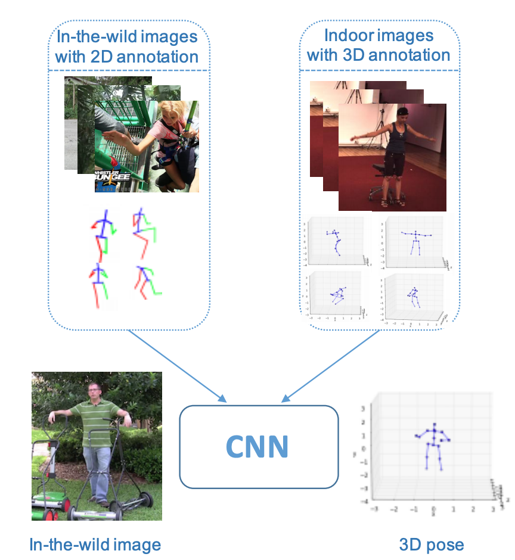

# Existing Implementation  
-----------

# Towards 3D Human Pose Estimation in the Wild: a Weakly-supervised Approach

This repository is the PyTorch implementation for the network presented in:

> Xingyi Zhou, Qixing Huang, Xiao Sun, Xiangyang Xue, Yichen Wei, 
> **Towards 3D Human Pose Estimation in the Wild: a Weakly-supervised Approach**
> ICCV 2017 ([arXiv:1704.02447](https://arxiv.org/abs/1704.02447))

<p align="center"> 
  
</p>

**<span style="color:red">Note: </span>** This repository has been updated and is different from the method discribed in the paper. To fully reproduce the results in the paper, please checkout the original [torch implementation](https://github.com/xingyizhou/pose-hg-3d) or our [pytorch re-implementation branch](https://github.com/xingyizhou/pytorch-pose-hg-3d/tree/hg3d) (slightly worse than torch). 
We also provide a clean [2D hourglass network branch](https://github.com/xingyizhou/pytorch-pose-hg-3d/tree/2D).

The updates include:
- Change network backbone to ResNet50 with deconvolution layers ([Xiao et al. ECCV2018](https://github.com/Microsoft/human-pose-estimation.pytorch)). Training is now about 3x faster than the original hourglass net backbone (but no significant performance improvement). 
- Change the depth regression sub-network to a one-layer depth map (described in our [StarMap project](https://github.com/xingyizhou/StarMap)).
- Change the Human3.6M dataset to official release in [ECCV18 challenge](http://vision.imar.ro/human3.6m/challenge_open.php). 
- Update from python 2.7 and pytorch 0.1.12 to python 3.6 and pytorch 0.4.1.

Contact: [zhouxy2017@gmail.com](mailto:zhouxy2017@gmail.com)

## Installation
The code was tested with [Anaconda](https://www.anaconda.com/download) Python 3.6 and [PyTorch]((http://pytorch.org/)) v0.4.1. After install Anaconda and Pytorch:

1. Clone the repo:

    ~~~
    POSE_ROOT=/path/to/clone/pytorch-pose-hg-3d
    git clone https://github.com/xingyizhou/pytorch-pose-hg-3d POSE_ROOT
    ~~~


2. Install dependencies (opencv, and progressbar):

    ~~~
    conda install --channel https://conda.anaconda.org/menpo opencv
    conda install --channel https://conda.anaconda.org/auto progress
    ~~~
3. Disable cudnn for batch_norm (see [issue](https://github.com/xingyizhou/pytorch-pose-hg-3d/issues/16)):
    
    ~~~
    # PYTORCH=/path/to/pytorch
    # for pytorch v0.4.0
    sed -i "1194s/torch\.backends\.cudnn\.enabled/False/g" ${PYTORCH}/torch/nn/functional.py
    # for pytorch v0.4.1
    sed -i "1254s/torch\.backends\.cudnn\.enabled/False/g" ${PYTORCH}/torch/nn/functional.py
    ~~~
4. Optionally, install tensorboard for visializing training. 

    ~~~
    pip install tensorflow
    ~~~

## Demo
- Download our pre-trained [model](https://drive.google.com/open?id=1_2CCb_qsA1egT5c2s0ABuW3rQCDOLvPq) and move it to `models`.
- Run `python demo.py --demo /path/to/image/or/image/folder [--gpus -1] [--load_model /path/to/model]`. 

`--gpus -1` is for CPU mode. 
We provide example images in `images/`. For testing your own image, it is important that the person should be at the center of the image and most of the body parts should be within the image. 

## Benchmark Testing
To test our model on Human3.6 dataset run 

~~~
python main.py --exp_id test --task human3d --dataset fusion_3d --load_model ../models/fusion_3d_var.pth --test --full_test
~~~

The expected results should be 64.55mm.

## Training
- Prepare the training data:
  - Download images from [MPII dataset](http://human-pose.mpi-inf.mpg.de/#download) and their [annotation](https://onedrive.live.com/?authkey=%21AKqtqKs162Z5W7g&id=56B9F9C97F261712%2110696&cid=56B9F9C97F261712) in json format (`train.json` and `val.json`) (from [Xiao et al. ECCV2018](https://github.com/Microsoft/human-pose-estimation.pytorch)).
  - Download [Human3.6M ECCV challenge dataset](http://vision.imar.ro/human3.6m/challenge_open.php).
  - Download [meta data](https://www.dropbox.com/sh/uouev0a1ao84ofd/AADzZChEX3BdM5INGlbe74Pma/hm36_eccv_challenge?dl=0&subfolder_nav_tracking=1) (2D bounding box) of the Human3.6 dataset (from [Sun et al. ECCV 2018](https://github.com/JimmySuen/integral-human-pose)). 
  - Place the data (or create symlinks) to make the data folder like: 
  
  ```
  ${POSE_ROOT}
  |-- data
  `-- |-- mpii
      `-- |-- annot
          |   |-- train.json
          |   |-- valid.json
          `-- images
              |-- 000001163.jpg
              |-- 000003072.jpg
  `-- |-- h36m
      `-- |-- ECCV18_Challenge
          |   |-- Train
          |   |-- Val
          `-- msra_cache
              `-- |-- HM36_eccv_challenge_Train_cache
                  |   |-- HM36_eccv_challenge_Train_w288xh384_keypoint_jnt_bbox_db.pkl
                  `-- HM36_eccv_challenge_Val_cache
                      |-- HM36_eccv_challenge_Val_w288xh384_keypoint_jnt_bbox_db.pkl
  ```

- Stage1: Train 2D pose only. [model](https://drive.google.com/open?id=1WqW1-_gCyGTB80m9MK_KUoD0dtElEQzv), [log](https://drive.google.com/open?id=1yKwmGD4MURHnDD5536niPjxe-keY3HGs)

```
python main.py --exp_id mpii
```

- Stage2: Train on 2D and 3D data without geometry loss (drop LR at 45 epochs). [model](https://drive.google.com/open?id=13d3AqzA85TSO7o1F8aq_ptnAkJ7LSp9-), [log](https://drive.google.com/open?id=18B_aOM9djCHZFlB0Rcoa6zOK1eXvsmRl)

```
python main.py --exp_id fusion_3d --task human3d --dataset fusion_3d --ratio_3d 1 --weight_3d 0.1 --load_model ../exp/mpii/model_last.pth --num_epoch 60 --lr_step 45
```

- Stage3: Train with geometry loss. [model](https://drive.google.com/open?id=1_2CCb_qsA1egT5c2s0ABuW3rQCDOLvPq), [log](https://drive.google.com/open?id=1hV4V74lTUd3COnoe1XMiTb8EUcyI8obN)

```
python main.py --exp_id fusion_3d_var --task human3d --dataset fusion_3d --ratio_3d 1 --weight_3d 0.1 --weight_var 0.01 --load_model ../models/fusion_3d.pth  --num_epoch 10 --lr 1e-4
```


# Integrating the 3DPW Dataset
______________________________

## Downloading data:
```
https://virtualhumans.mpi-inf.mpg.de/3DPW/evaluation.html
```

## Structure of 3dpw dataset in the data folder
```
 |------3dpw
        |------imageFiles
               |-----courtyard_arguing_00
               |     |-----image_0000_1.jpg, image_0000_1.jpg, etc.
               |-----courtyard_backpacking_00
               |     |-----image_0000_1.jpg, image_0000_1.jpg, etc.
               |... etc
        |------sequenceFiles
               |-----train
               |     |-----downtown_arguing_00.pkl, downtown_cafe_00.pkl, etc.
               |-----test
               |     |-----downtown_arguing_00.pkl, downtown_cafe_00.pkl, etc.
               |-----validation
               |     |-----downtown_arguing_00.pkl, downtown_cafe_00.pkl, etc.
```
## DEMO of existing model
   ```
   python demo.py --demo ../images --gpus -1 --load_model ../models/fusion_3d_var.pth
   ```

## Changes:
1. Added threedpw.py script in src/lib/datasets
2. Added the dataset in main.py, opts.py
3. Train the model:
   Change the current directory to src folder
   ```
   python main.py --exp_id threedpw
   ```

4. Run DEMO for 3dpw dataset
   ```
   python demo.py --demo ../data/3dpw/imageFiles --dataset threedpw --gpus -1 --load_model ../models/fusion_3d_var.pth
   ```

## Result Comparison

#### Existing model i.e. mpii and h36m datasets
<!images/ExistingResult.png>

#### 3DPW dataset
<!images/Newresult.png>

## Conclusion
The paper effectively uses convolutional neural networks for pose estimation. The inclusion of the 3DPW dataset not only allows the model to predict poses on a new dataset but also potentially improves the generalizability of the model. The results after integrating the 3DPW dataset were not initially accurate, which may be due to the necessity for further training, optimization, or potential issues with the dataset integration. Nonetheless, with a few minor changes and potential future improvements, the project demonstrates the application of deep learning for 2D and 3D pose estimation tasks.

THANKYOU! 

## Citation

    @InProceedings{Zhou_2017_ICCV,
    author = {Zhou, Xingyi and Huang, Qixing and Sun, Xiao and Xue, Xiangyang and Wei, Yichen},
    title = {Towards 3D Human Pose Estimation in the Wild: A Weakly-Supervised Approach},
    booktitle = {The IEEE International Conference on Computer Vision (ICCV)},
    month = {Oct},
    year = {2017}
    }

    3dpw dataset: https://virtualhumans.mpi-inf.mpg.de/3DPW/license.html
    
    @inproceedings{vonMarcard2018,
    title = {Recovering Accurate 3D Human Pose in The Wild Using IMUs and a Moving Camera},
    author = {von Marcard, Timo and Henschel, Roberto and Black, Michael and Rosenhahn, Bodo and Pons-Moll, Gerard},
    booktitle = {European Conference on Computer Vision (ECCV)},
    year = {2018},
    month = {sep}
    }
